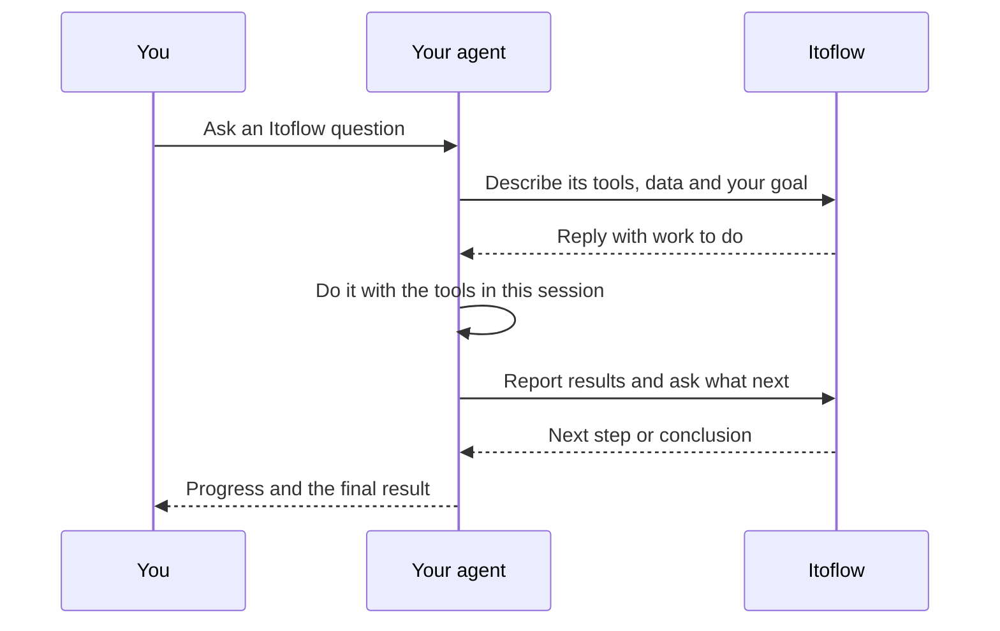

# Itoflow plugin and skills

Connect your AI agent to [Itoflow](https://itoflow.ai/) for investment
research, portfolios, strategies and monitors. The plugin adds the Itoflow MCP
server and two skills to Claude, ChatGPT, Codex, Gemini CLI and other agents.

| Skill | Use it to |
| --- | --- |
| [`itoflow`](skills/itoflow/SKILL.md) | Run research and work with portfolios, strategies and monitors. |
| [`worker`](skills/worker/SKILL.md) | Let Itoflow lead an analysis that needs files, databases or tools on your machine. |

You need an Itoflow account. Each client signs you in through your browser and
stores the sign-in itself. The plugin holds no keys or tokens.

```text
Install the plugin → Sign in to Itoflow → Ask for something read-only
```

## Install

### Claude Code

```bash
claude plugin marketplace add itoflow/skills
claude plugin install itoflow@itoflow
```

Or, inside a session, run `/plugin marketplace add itoflow/skills` and then
`/plugin install itoflow@itoflow`.

Then enter `/mcp`, select **itoflow**, choose **Authenticate** and sign in.
Use the skills as `/itoflow:itoflow` and `/itoflow:worker`.

### Claude desktop app

Open **Customize → Plugins → Add → Add marketplace** and enter
`itoflow/skills`. Install **Itoflow**, then sign in when Claude asks.

To use only the MCP server in Claude on the web, add
`https://mcp.itoflow.ai/mcp` as a custom connector. See
[connect your AI assistant](https://docs.itoflow.ai/mcp/install).

### Codex

```bash
codex plugin marketplace add itoflow/skills
codex plugin add itoflow@itoflow
codex mcp login itoflow
```

Codex usually starts sign-in when you install. Run `codex mcp login itoflow`
if it doesn't, then start a new task.

### ChatGPT

1. Open [ChatGPT plugins](https://chatgpt.com/plugins).
2. Select **+**, then **Add custom MCP server**.
3. Name it **Itoflow** and enter `https://mcp.itoflow.ai/mcp`.
4. Choose OAuth, accept the warning, then select **Create as a plugin**.
5. Sign in to Itoflow when your browser opens.

In a chat, type `@` and pick Itoflow. Custom MCP servers get the Itoflow tools
but not the skills in this repository. Your plan or workspace settings decide
whether you can add one. See
[OpenAI's guide](https://developers.openai.com/plugins/deploy/connect-chatgpt).

### Gemini CLI

```bash
gemini extensions install https://github.com/itoflow/skills
```

Gemini CLI finds the Itoflow sign-in on its own and opens your browser the
first time you use a tool.

### Other agents

To add only the skills to any agent that supports them, such as Cursor, Cline
or OpenCode, use the [skills CLI](https://github.com/vercel-labs/skills):

```bash
npx skills add itoflow/skills
```

Then add `https://mcp.itoflow.ai/mcp` to the agent as a Streamable HTTP MCP
server with OAuth sign-in. The skills need that connection.

This repository also follows the [Agent Plugins](https://agent-plugins.org/)
format, through `plugin.json`, `mcp.json` and `skills/`, for agents that
install plugins from a Git repository.

## Check that it works

Start a new task and check that the Itoflow server lists `search`, `execute`
and `workspace_list`. Then ask:

```text
Use Itoflow to list my portfolios. Do not create or change anything.
```

Any list, even an empty one, means the connection works. If the tools don't
appear, restart the client or start a new task. If sign-in didn't finish, run
it again from the client's MCP settings. See
[troubleshooting](https://docs.itoflow.ai/mcp/troubleshooting).

## How the worker skill works



Itoflow leads the research: it picks sources and methods, reviews the evidence
and writes the conclusion. Your agent fetches data, transforms it and runs code
as asked, then returns results with their sources and checks. It uses the
access your session already has and never sends credentials to Itoflow.

## Releases

| Branch | Versions | Install from |
| --- | --- | --- |
| `main` | Stable, such as `0.3.0` | `itoflow/skills`, as above |
| `develop` | Preview, such as `0.3.0-develop.h1a2b3c4d5` | `itoflow/skills#develop` in Claude, `--ref develop` in Codex and Gemini CLI |

Every new plugin version on either branch publishes a
[GitHub release](https://github.com/itoflow/skills/releases) with:

- `itoflow-<version>.tar.gz`, the plugin as a local marketplace.
- `itoflow-<version>-openai.zip`, the plugin in the format the ChatGPT and
  Codex plugin directory accepts.
- A `.sha256` checksum for each file.

The latest stable archive is always at
`https://github.com/itoflow/skills/releases/latest/download/itoflow.tar.gz`.

To install from an archive, extract it and add its `itoflow` folder:

```bash
curl -LO https://github.com/itoflow/skills/releases/latest/download/itoflow.tar.gz
tar -xzf itoflow.tar.gz
claude plugin marketplace add ./itoflow
claude plugin install itoflow@itoflow
```

For Codex, run `codex plugin marketplace add ./itoflow`, then
`codex plugin add itoflow@itoflow`. Keep the folder in place after you install.

Both channels use the same marketplace name, so remove one before you add the
other.

## Test a local copy

```bash
git clone https://github.com/itoflow/skills
node skills/scripts/validate.mjs skills
claude plugin marketplace add ./skills
claude plugin install itoflow@itoflow
```

Claude Code loads a local marketplace in place, so your edits apply when you
next start a session or run `/reload-plugins`.

## Repository layout

```text
.claude-plugin/        Claude Code manifest and marketplace
.codex-plugin/         Codex and ChatGPT manifest
.agents/plugins/       Codex marketplace
plugin.json, mcp.json  Agent Plugins manifest and MCP server
gemini-extension.json  Gemini CLI extension
.mcp.json              MCP server for Claude Code and Codex
skills/                The skills
assets/                Icons for plugin directories
```

## Contributing, security and license

We publish this repository from Itoflow's own codebase. See
[CONTRIBUTING.md](CONTRIBUTING.md) for how we handle issues and pull requests.
Report security problems as described in [SECURITY.md](SECURITY.md).
Licensed under the [Apache License 2.0](LICENSE).
