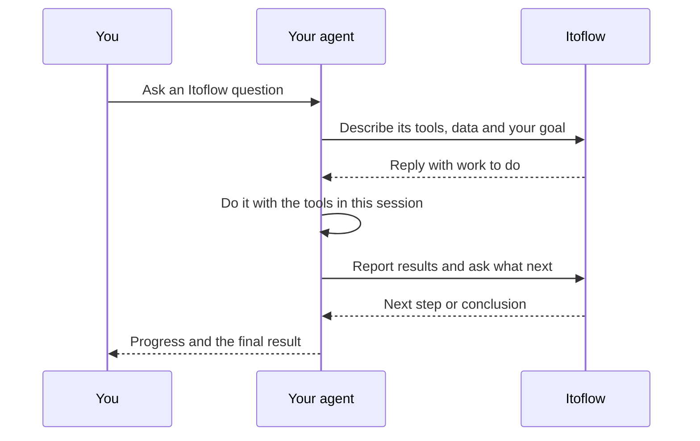

# Itoflow plugin and skills

Connect your AI agent to [Itoflow](https://itoflow.ai/) for investment
research, portfolios, strategies and monitors. The plugin adds the Itoflow MCP
server and two skills to Claude, ChatGPT, Codex, Gemini, GitHub Copilot, Cursor
and other agents.

| Skill | Use it to |
| --- | --- |
| [`itoflow`](skills/itoflow/SKILL.md) | Run research and work with portfolios, strategies and monitors. |
| [`worker`](skills/worker/SKILL.md) | Let Itoflow lead an analysis that needs files, databases or tools on your machine. |

Each client signs you in through your browser and stores the sign-in itself.
The plugin holds no keys or tokens.

```text
Install the plugin → Sign in to Itoflow → Check the connection → Read and make changes
```

## What you can do

Your agent can read your Itoflow data and change it.

| Goal | Example request |
| --- | --- |
| Research an investment question | "Use Itoflow to compare SPY and VTI, with sources and key differences." |
| Review holdings | "List my Itoflow portfolios, then summarize the holdings in the one I choose." |
| Import a portfolio | "Validate these holdings and show me the proposed import before saving it." |
| Create or change a monitor | "Create a research monitor for NVDA and TSM that reports material news and filings every weekday at 07:30. Show it to me before creating it." |
| Create or edit a strategy | "Raise the cash reserve in my Itoflow strategy to 10%." |
| Check strategies and monitors | "Show my strategies and monitors, and summarize their latest results." |
| Get research files | "Find the CSV this Itoflow chat produced and read it." |

Changes follow Itoflow's own rules. The `itoflow` skill shows you a portfolio
import before it saves it and waits for your confirmation. Live trades still
need your approval in Itoflow, and your plan's limits apply. Connecting an
agent does not connect a brokerage account.

## Install

Find the row for the product and the place you use it. **You get** says what
it installs:

- **Plugin**: the Itoflow server and both skills, installed together.
- **Server + skills**: you add the server and the skills in two steps.

| Product | Where | You get | Steps |
| --- | --- | --- | --- |
| Claude Code | Terminal, Claude desktop app (Code tab), VS Code, JetBrains | Plugin | [Claude Code](#claude-code) |
| Claude | claude.ai, Claude desktop app, Cowork, mobile app | Plugin | [Claude](#claude-web-and-desktop-app) |
| Codex | Terminal, ChatGPT desktop app | Plugin | [Codex](#codex) |
| Codex | IDE extension | Server + skills | [Codex](#codex) |
| ChatGPT | chatgpt.com, ChatGPT desktop app | Plugin | [ChatGPT](#chatgpt) |
| Gemini CLI | Terminal | Plugin | [Gemini](#gemini) |
| Gemini app | gemini.google.com, mobile app | Server + skills | [Gemini](#gemini) |
| GitHub Copilot | Copilot CLI, VS Code | Plugin | [GitHub Copilot](#github-copilot) |
| GitHub Copilot | Visual Studio, JetBrains | Server + skills | [GitHub Copilot](#github-copilot) |
| Cursor | Cursor app | Plugin | [Cursor](#cursor) |
| Any other client | | Server + skills | [Any other client](#any-other-client) |

You need an Itoflow account. Sign-in happens in your browser the first time the
client connects to `https://mcp.itoflow.ai/mcp`.

### Claude Code

**Terminal (CLI):**

```bash
claude plugin marketplace add itoflow/skills
claude plugin install itoflow@itoflow
```

Or, inside a session, run `/plugin marketplace add itoflow/skills`, then
`/plugin install itoflow@itoflow`. Then run `/mcp`, select the Itoflow server,
choose **Authenticate** and sign in. Use the skills as `/itoflow:itoflow` and
`/itoflow:worker`.

**Claude desktop app, Code tab:** the terminal, the desktop app's local
sessions and the VS Code extension on one computer share the same settings.
Add the marketplace with the terminal commands above, then install from
**+ → Plugins → Add plugin**. Plugins work in local and SSH sessions, not in
cloud sessions.

**VS Code (Claude Code extension):** type `/plugins` in the Claude panel. On
the **Marketplaces** tab, enter `itoflow/skills`, then install **itoflow** from
the **Plugins** tab. Use `/mcp` in the panel to sign in.

**JetBrains:** the Claude Code plugin runs the CLI in the IDE's terminal, so
use the terminal steps.

See [Discover and install plugins](https://code.claude.com/docs/en/discover-plugins).

### Claude (web and desktop app)

This covers chat on claude.ai in a browser, chat in the Claude desktop app, and
Cowork.

1. Open **Customize → Plugins**, select **Add**, then **Add marketplace**.
2. Enter `itoflow/skills` and install **Itoflow**.
3. Open the plugin, go to its **Connectors** tab, add the Itoflow connector,
   then connect it and sign in. Adding a plugin does not connect its server.
4. In a chat, describe the task, or type `/` and pick an Itoflow skill.

Once added, the plugin is on your Claude account, so it also works in chat on
the Claude mobile app and syncs to Claude Code.

On Team and Enterprise plans, an Owner decides whether members can add their
own marketplaces, and an Owner adds the connector for the organization before
members can connect it.

If you can't add a marketplace, download
[`itoflow.zip`](https://github.com/itoflow/skills/releases/latest/download/itoflow.zip)
and use **Add → Upload plugin**. An uploaded plugin does not update by itself.

See [Plugins](https://claude.com/docs/plugins/overview) in Claude's docs.

### Codex

**Terminal (CLI):**

```bash
codex plugin marketplace add itoflow/skills
codex plugin add itoflow@itoflow
codex mcp login itoflow
```

Codex usually starts sign-in when you install. Run `codex mcp login itoflow`
if it doesn't, then start a new session and pick an Itoflow skill.

**ChatGPT desktop app (Codex):** add the marketplace with the terminal command
above, then install Itoflow from the app's **Plugins** tab. OpenAI does not yet
document adding a GitHub marketplace inside the app.

**IDE extension (VS Code, Cursor, Windsurf):** set up the server and the skills
in two steps. Add the server from the gear menu: **MCP servers → Add server**,
choose **Streamable HTTP**, enter `https://mcp.itoflow.ai/mcp`, then select
**Authenticate**. Add the skills with `npx skills add itoflow/skills -a codex`.
The app, the CLI and the extension share one MCP setup.

See [Plugins](https://learn.chatgpt.com/docs/plugins) and
[MCP](https://learn.chatgpt.com/docs/extend/mcp) in OpenAI's docs.

### ChatGPT

ChatGPT installs the plugin in one of two ways:

| Way | Who does it |
| --- | --- |
| Upload the plugin archive | You, on chatgpt.com |
| Import this repository from GitHub | A workspace admin; ChatGPT keeps it up to date daily |

**Upload the plugin archive (you, on the web):**

1. Download
   [`itoflow-openai.zip`](https://github.com/itoflow/skills/releases/latest/download/itoflow-openai.zip)
   from the latest release.
2. On chatgpt.com, open [Plugins](https://chatgpt.com/plugins), select
   **Add**, then **Upload plugin archive**, and choose the ZIP.
3. Find **Itoflow** in your personal plugins and install it. Connect it and
   sign in when ChatGPT asks.
4. In a chat, type `@` and pick Itoflow, or let ChatGPT use it when your request
   matches.

To update, open the plugin's details and select **Upload new version** with
the newer ZIP. The upload option appears only when your plan or workspace allows
it; on Enterprise, an admin turns on **Upload plugins** for your role. Skills in
ChatGPT are generally available on Business, Enterprise, Healthcare and Edu.

**Import from GitHub (workspace admin):** in the Admin Console, open
**Plugins**, select **Add → Import marketplace**, enter
`https://github.com/itoflow/skills` as the source and leave **Path** empty.
ChatGPT syncs the plugin daily. Then set its installation policy so members can
install it.

ChatGPT can label a plugin that declares an MCP server **Desktop only**. If it
labels Itoflow that way, use it in the ChatGPT desktop app.

See [Plugins in ChatGPT](https://help.openai.com/en/articles/20001256-plugins-in-chatgpt)
and [importing marketplaces from GitHub](https://help.openai.com/en/articles/20001504-importing-and-syncing-plugin-marketplaces-from-github).

### Gemini

**Gemini CLI (terminal):**

```bash
gemini extensions install https://github.com/itoflow/skills
```

Gemini CLI installs the latest release. It finds the Itoflow sign-in by itself
and opens your browser the first time you use a tool; run `/mcp auth itoflow`
to sign in again. See
[Gemini CLI extensions](https://geminicli.com/docs/extensions/reference/).

**Gemini app (gemini.google.com and mobile):**

1. On gemini.google.com, open **Settings → Connected Apps**, then under
   **Custom apps** choose **Add a custom app** and enter
   `https://mcp.itoflow.ai/mcp`. Sign in when Gemini asks. Apps you add on the
   web also work in the mobile app.
2. Download
   [`itoflow-skill-itoflow.zip`](https://github.com/itoflow/skills/releases/latest/download/itoflow-skill-itoflow.zip)
   and
   [`itoflow-skill-worker.zip`](https://github.com/itoflow/skills/releases/latest/download/itoflow-skill-worker.zip),
   then upload each under **Settings → Skills → Upload**.

Custom apps need a personal Google account, age 18 or over, a location in the
US, and Keep Activity turned on. See
[custom apps](https://support.google.com/gemini/answer/17209137) and
[skills](https://support.google.com/gemini/answer/17094296) in Gemini's help.

### GitHub Copilot

**Copilot CLI (terminal):**

```bash
copilot plugin marketplace add itoflow/skills
copilot plugin install itoflow@itoflow
```

If Copilot doesn't open sign-in by itself, run `/mcp` in a session and sign in
to the Itoflow server. The CLI reads this repository's `plugin.json`, `mcp.json` and
`skills/`.

**VS Code:**

1. Make sure the `chat.plugins.enabled` setting is on.
2. Run **Chat: Install Plugin From Source** from the Command Palette and enter
   `https://github.com/itoflow/skills`.
3. Sign in when your browser opens on the first connection.

**Visual Studio and JetBrains:** add the server from Copilot Chat's MCP
settings, then copy the `skills/` folders to `~/.copilot/skills/`. In Visual
Studio 17.14 or later, switch to **Agent**, open **Tools**, select **+** and
**Add custom MCP server**; skills need Visual Studio 18.5 or later. In
JetBrains, select the tools icon in **Agent** mode and **Add MCP Tools**, and
turn on skills under **Settings → GitHub Copilot → Chat → Agent**. Where the
IDE asks for JSON, use:

```json
{ "servers": { "itoflow": { "url": "https://mcp.itoflow.ai/mcp" } } }
```

Sign in when the IDE asks. On Business and Enterprise plans, an admin must turn on the **MCP servers in
Copilot** policy. See
[Copilot CLI plugins](https://docs.github.com/en/copilot/reference/copilot-cli-reference/cli-plugin-reference),
[agent plugins in VS Code](https://github.com/microsoft/vscode-docs/blob/main/docs/agent-customization/agent-plugins.md)
and
[MCP in Copilot Chat](https://docs.github.com/en/copilot/how-tos/copilot-in-your-ide/customize-copilot/extend-copilot-with-tools-and-context/extend-copilot-chat-with-mcp).

### Cursor

Cursor loads plugins from `~/.cursor/plugins/local/`. Clone this repository
there, so `git pull` brings updates:

```bash
git clone https://github.com/itoflow/skills ~/.cursor/plugins/local/itoflow
```

Or unzip
[`itoflow.zip`](https://github.com/itoflow/skills/releases/latest/download/itoflow.zip)
into `~/.cursor/plugins/local/itoflow`. Then restart Cursor, or run
**Developer: Reload Window**, and sign in when Cursor asks. Cursor reads this
repository's `plugin.json`, `mcp.json` and `skills/`.

On Teams and Enterprise plans, an admin controls local plugins under
**Dashboard → Settings → Security & Identity → Marketplace and Plugins**; it is
off by default on Enterprise. An admin can instead import this repository under
**Dashboard → Plugins & MCPs → Add Marketplace → Import from Repo**, so members
install it from **Customize**. See [Cursor plugins](https://cursor.com/docs/plugins).

### Any other client

Add the two parts yourself:

1. Add the skills: run `npx skills add itoflow/skills`
   ([skills CLI](https://github.com/vercel-labs/skills)), copy the `skills/`
   folders into the client's skills folder (`.agents/skills/` works in many
   clients), or upload both skill ZIPs from the
   [latest release](https://github.com/itoflow/skills/releases/latest).
2. Add the server with these settings, then sign in when the client asks:

   | Setting | Value |
   | --- | --- |
   | Server name | `itoflow` |
   | Server URL | `https://mcp.itoflow.ai/mcp` |
   | Transport | Streamable HTTP (often labeled HTTP) |
   | Authentication | OAuth, through the client's browser sign-in |

The skills need the server connection.

## Check that it works

Start a new task and check that the Itoflow server lists `search`, `execute`
and `workspace_list`. Then make a first request that only reads, so nothing
changes while you test:

```text
Use Itoflow to list my portfolios. Do not create or change anything.
```

Any list, even an empty one, means the connection works. After that, ask for
anything in [What you can do](#what-you-can-do), including changes. If the tools don't
appear, restart the client or start a new task. If sign-in didn't finish, run
it again from the client's MCP settings. See
[troubleshooting](https://docs.itoflow.ai/mcp/troubleshooting).

## How the worker skill works



Itoflow leads the research: it picks sources and methods, reviews the evidence
and writes the conclusion. Your agent fetches data, transforms it and runs code
as asked, then returns results with their sources and checks. It uses the
access your session already has and never sends credentials to Itoflow.

## Releases

Installing from `itoflow/skills` gives you the latest release on `main`. Every
new plugin version publishes a
[GitHub release](https://github.com/itoflow/skills/releases) with:

- `itoflow-<version>.zip`, the plugin with every client's manifest. Use it with
  Claude's **Upload plugin**, or unzip it as a local marketplace.
- `itoflow-<version>-openai.zip`, the plugin for ChatGPT's
  **Upload plugin archive** and the ChatGPT and Codex plugin directory.
- `itoflow-<version>-skill-itoflow.zip` and
  `itoflow-<version>-skill-worker.zip`, one skill each with `SKILL.md` at the
  root, for apps that upload skills.
- A `.sha256` checksum for each file.

Each ZIP also has a copy without the version, so the latest is always at
`https://github.com/itoflow/skills/releases/latest/download/<name>`, for
example `itoflow.zip` or `itoflow-skill-worker.zip`.

To install without Git, unzip the plugin into a folder and add that folder as a
marketplace:

```bash
curl -LO https://github.com/itoflow/skills/releases/latest/download/itoflow.zip
unzip itoflow.zip -d itoflow
claude plugin marketplace add ./itoflow
claude plugin install itoflow@itoflow
```

For Codex, run `codex plugin marketplace add ./itoflow`, then
`codex plugin add itoflow@itoflow`. Keep the folder in place after you install.

## Test a local copy

```bash
git clone https://github.com/itoflow/skills
node skills/scripts/validate.mjs skills
claude plugin marketplace add ./skills
claude plugin install itoflow@itoflow
```

Claude Code loads a local marketplace in place, so your edits apply when you
next start a session or run `/reload-plugins`.

## Repository layout

```text
.claude-plugin/        Claude Code manifest and marketplace
.codex-plugin/         Codex and ChatGPT manifest
.agents/plugins/       Codex marketplace
plugin.json, mcp.json  Agent Plugins manifest and MCP server
gemini-extension.json  Gemini CLI extension
.mcp.json              MCP server for Claude Code and Codex
skills/                The skills
assets/                Icons for plugin directories
```

## Contributing, security and license

We publish this repository from Itoflow's own codebase. See
[CONTRIBUTING.md](CONTRIBUTING.md) for how we handle issues and pull requests.
Report security problems as described in [SECURITY.md](SECURITY.md).
Licensed under the [Apache License 2.0](LICENSE).
